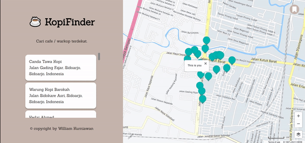

# KopiFinder
Simple web application to show top 20 nearest coffee shop / cafe near you. This WebApp was built with vanilla js, scss, and html.

### Installation Guide
1. Clone this repo or download as zip file.
2. Run this command on your terminal to install all packages needed.
```javascript
npm install
```
3. Run this command to start web development server and bundle all file using parcel.js
```javascript
npm start 
```


### App Preview
